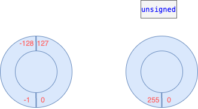
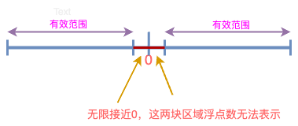
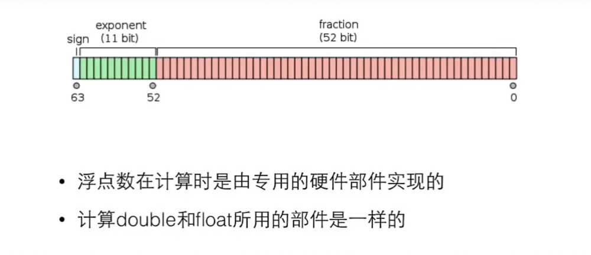

## c语言的类型

1. 整数
    * char、short、int、long、longlong
2. 浮点数
    * float、double、long double
3. 逻辑
    * bool
4. 指针
5. 自定义类型

## 类型有何不同

1. 类型名称：int、long、double
2. 输入输出的格式化：%d、%ld、%lf
3. 所表达的数的范围：char < short < int < float < double
4. 内存中所占用的大小：1字节到16个字节
5. 内存中的表达形式：二进制数（补码）、编码

## sizeof

* 是一个运算符，给出某个类型或变量在内存中所占据的字节数
* 例：sizeof(int)
* 例：sizeof(i)
* 是静态运算符，它的结果在编译的时刻就决定了
* 不要在sizeof的括号里做运算，这些运算不会做的

## 整数

* char：1字节（8比特）
* short：2字节
* int：取决于编译器（CPU），通常的意义是“1个字”。想要表达的是“一个寄存器的大小”
* long：取决于编译器（CPU），通常的意义是“1个字”
* longlong：8字节

## 整数的内部表达

* 计算机的内部一切都是二进制
    * 18  -> 00010010
    * 0   -> 00000000
    * -18 -> ?

## 如何表示负数

* 十进制用“-”来表示负数，在做计算的时候

## 二进制负数

* 1个字节可以表达的数：
    * 00000000 ～ 11111111 (0~255)
* 三种方案：
    1. 仿照十进制，有一个特殊的标志表示负数
    2. 取中间的数未0，如10000000表示0，比它小的是负数，比它大的是正数
    3. 补码（最佳）
        * 考虑-1，我们希望-1 + 1 -> 0，如何做到？
            * 0 -> 00000000
            * 1 -> 00000001
            * 11111111 + 00000001 -> 100000000 (8bit)多出来的那个1会被丢掉 => 00000000
        * 因为0 - 1 -> -1，所以 -1 = 
            * (1)00000000 - 00000001 -> 11111111
            * 所以11111111就是-1，当作纯二进制来看，是255，当做补码来看待时，是-1
        * 同理，对于-a，其补码就是0-a，实际是2^n - a，n是这种类型的位数
        * 补码的意义：就是拿补码和原码可以加粗一个溢出的“零”

## 数的范围

* 对于一个字节（8位），可以表达的是：
    * 00000000 ~ 11111111
    * 其中：
        * 00000000 -> 0
        * 11111111 ~ 10000000 -> -1 ~ -128 当作补码看待
        * 00000001 ~ 01111111 ->  1 ~  127 


## unsigned

* 如果一个字面量常数想要表达自己是unsigned，可以在后面加u或U
    * 255U
* 用l或L表示long(long)
* unsigned的初衷并非扩展数能表达的范围，而是为了做纯二进制运算，主要是为了移位

没有补码，只有正数部分，副作用：会使得正数部分被扩大

## 整数越界

* 整数是以纯二进制方式进行计算的，所以：
    * 11111111 + 1 -> 100000000 -> 0
    * 01111111 + 1 -> 10000000 -> -128
    * 10000000 - 1 -> 01111111 -> 127



## 整数的输入输出

* 只有两种形式：int或long long
* %d : int
* %u : unsigned
* %ld: long long
* %lu: unsigned long

## 8进制和16进制

* 一个以0开始的数字字面量是8进制
* 一个以0x开始的数字字面量是16进制
* %o用于8进制，%x用于16进制
* 8进制和16进制只是如何把数字表达为字符串，与内部如何表达数字无关

* 16进制很适合表达二进制数据，因为4位二进制正好是一个16进制位
    * 二进制：  0001 0010
    * 十六进制：  1    2
* 8进制的一位数字正好表达3位二进制
    * 因为早期计算机的字长是12的倍数，而非8

## 选择整数类型

* 为什么整数要有那么多种？
    * 为了准确表达内存、做底层程序的需要
* 没有特殊需要，就选择int
    * 现在的CPU的字长普遍是32位或64位，一次内存读写就是一个int，一次计算也是一个int，选择更短的类型不会更快，甚至可能更慢
    * 现代的编译器一般会设计内存对齐，所以更短的类型实际在内存中有可能也占据一个int的大小（虽然sizeof告诉你更小）
* unsigned与否只是输出的不同，内部计算是一样的

## 浮点类型

| 类型    | 字长 | 有效数字 | 输入scanf | 输出printf |
| ------ | --- | ------- | --------- | --------- |
| float  | 32  | 7       | %f        | %f,%e     |
| double | 64  | 15      | %lf       | %f,%e     |



## 科学计数法

例如：-5.67E+16

```c
double x = 123.456e+3; // 123.456 x 10^3
// 等同于
double x = 123.456e3;

0.3E6
// 等同于
.3E6

3.0E6
// 等同于
3.E6
```

## 超过范围的浮点数

* printf输出int表示超过范围的浮点数：(+/-)∞
* printf输出nan表示不存在的浮点数

## 浮点数的内部表达

不是一个真正的二进制数，而是一个编码



## 选择浮点类型

* 如果没有特殊需要，只使用double
* 现在CPU能直接对double做硬件运算，性能不会比float差，在64位的机器上，数据存储的速度也不比float慢

## 字符类型 (character)

* char是一个整数，也是一种特殊的类型：字符。这是因为：
    * 用单引号表示的字符字面量：'a', '1'
    * "也是一个字符
    * printf和scanf里用%c来输入输出字符

## 大小写转换

* 字母在ASCll表中是顺序排列的
* 大写字母和小写字母是分开排列的，并不在一起
* 'a'-'A'可以得到两段之间的距离，于是
    * a+'a'-'A'可以把一个大写字母变成小写字母
    * a+'A'-'a'可以把一个小写字母变成大写字母

## 逃逸字符

* 用来表示无法打印出来的控制字符或特殊字符，它由一个反斜杠"\"开头，后面跟上另一个字符，这两个字符合起来，组成了一个字符

| 字符 | 意义 |
| --- | ------- |
| \b  | 回退一格 |
| \t  | 到下一个表格位 |
| \n  | 换行    |
| \r  | 回车    |
| \"  | 双引号  |
| \'  | 单引号  |
| \\  | 反斜杠本身 |

## 制表位

* 每行的固定位置（不是固定大小）
* 一个\t使得输出从下一个制表位开始
* 用\t才能使得上下两行对齐

## 自动类型转换

* 当运算符的两边出现不一致的类型时，会自动转换成较大的类型
    * 大的意思是能表达的数的范围更大
    * char -> short -> int -> long -> long long
    * int -> float -> double
* 对于printf，任何小于int的类型会被转换成int；float会被转换成double
* 但是scanf不会，要输入short，需要%hd

## 强制类型转换

* 要把一个量强制转换成另一个类型（通常是较小的类型），需要：
    * (类型)值
        * 例如：(int)10.2
        * 例如：(short)32
    * 注意这时候的安全性，小的变量不总能表达大的量
        * 例如：(short)32768
    * 强制类型转换的优先级高于四则运算

## 逻辑类型 (bool)

* #include `<stdbool.h>`
* 之后就可以使用bool和true、false
* 实际上没有真正的布尔，它仍然是整数

## 逻辑运算

* 逻辑运算是对逻辑量进行的运算，结果只有0或1
* 逻辑量是关系运算或逻辑运算的结果

| 运算符   | 描述   | 示例     | 结果 |
| ------- | ----- | -------- | --- |
| `!`     | 逻辑非 | !a       | 如果a是true，结果是false；如果a是false，结果就是true |
| `&&`    | 逻辑与 | a&&b     | 如果a和b都是true，结果就是true；否则都是false |
| `\|\|`  | 逻辑或 | a`\|\|`b | 如果a和b有一个是true，结果为true；两个都是false，结果为false |

* 如果要表达数学中的区间，如：x (4, 6)或 x [4, 6]，应该如何写c的表达式？
    * 像4 < x < 6这样的式子，不是c能正确计算的式子，因为4 < x < 6的结果是一个逻辑值（0或1）
    * (4, 6)用：x > 4 && x < 6；[4, 6]用：x >=4 && x <= 6
* 如何判断一个字符c是否是大写字母？
    * c >= 'A' && c <= 'Z'
* age > 20 && age < 30     意思：在20～30之间
* index < 0 || index > 99  意思：不在0～99之间
* !age < 20                意思：永远是1，因为单目运算符优先级高于多目运算符，!age=0或1

## 优先级

| 优先级 | 运算符       | 结合性  |
| ----- | ----------- | ------- |
| 1     | ()          | 从左到右 |
| 2     | ! + - ++ -- | 从右到左(单目的+和-) |
| 3     | * / %       | 从左到右 |
| 4     | + -         | 从左到右 |
| 5     | < <= > >=   | 从左到右 |
| 6     | == !=       | 从左到右 |
| 7     | &&          | 从左到右 |
| 8     | `\|\|`      | 从左到右 |
| 9     | = += -= *= /= %= | 从右到左 |

## 短路

* 逻辑运算是自左向右进行的，如果左边的结果已经能够决定结果了，就不会做右边的运算
    * a == 6 && b == 1
    * a == 6 && b += 1
* 对于&&，左边是false时就不做右边了
* 对于||，左边是true时就不做右边了
* 注意：根据以上，不要把赋值，包括复合赋值组合进表达式

## 条件运算符

* count = (count>20) ? count-10 : count+10;
* 条件、条件满足时的值和条件不满足时的值
* 条件运算符的优先级高于赋值运算符，但是低于其他运算符
    * m < n ? x : a+5
    * a++ >= 1 && b-- > 2 ? a : b
    * x = 3*a>5 ? 5 : 20
* 嵌套条件表达式（不希望这样）
    * count = (count>20) ? (count<50) ? count-10 : count-5 : (count<10) ? count+10 : count+5;

## 逗号运算符

* 逗号用来连接两个表达式，并以其右边的表达式的值作为它的结果。逗号的优先级是所有的运算符中最低的，所以它两边的表达式会先计算；逗号的组合关系是自左向右，所有左边的表达式会先计算，而右边的表达式的值就留下来作为逗号运算的结果。

